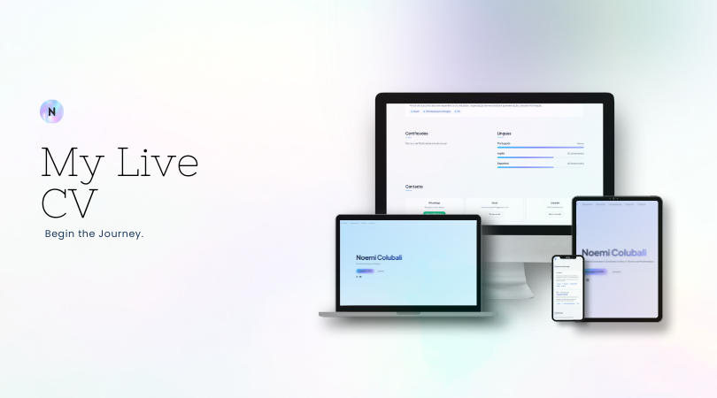

#Live-CV

<p align="center">
  <a href="https://live-cv-lovat.vercel.app" target="_blank" rel="noopener noreferrer">
    
  </a>
</p>

<p align="center">
  <a href="https://live-cv-lovat.vercel.app">Ver demo</a>
</p>

Currículo online em formato one-page, responsivo e multilíngue (PT, ES, EN), com tema visual que acompanha o idioma selecionado.


---

## Funcionalidades

- **Três idiomas**: Português, Espanhol e Inglês com troca instantânea
- **Tema por idioma**: fundo, degradé do nome e barras de nível de línguas adaptam-se ao idioma (PT / ES / EN)
- **Secções**: Experiência, Formação, Competências, Projetos, Certificados, Línguas, Contacto
- **Contacto**: cards para WhatsApp, Email e LinkedIn (sem formulário; WhatsApp abre conversa direta)
- **Acessibilidade**: `prefers-reduced-motion` respeitado, labels e estrutura semântica
- **Ícone animado**: logo “N” no header com animação lava-lamp em CSS

---

## Stack

| Tecnologia   | Uso                    |
| ------------ | ---------------------- |
| React 19     | UI                     |
| TypeScript   | Tipagem                |
| Vite 8       | Build e dev server     |
| Tailwind CSS 4 | Estilos e tema      |
| i18n manual  | Traduções (PT/ES/EN)   |

---

## Como correr em local

```bash
# Instalar dependências
npm install

# Desenvolvimento
npm run dev

# Build para produção
npm run build

# Pré-visualizar build
npm run preview
```

---

## Estrutura do projeto

```
cv-noemi/
├── public/           # favicon, PDFs do CV (por idioma)
├── src/
│   ├── components/    # NavLinks, LanguageSwitcher, FadeInSection, etc.
│   ├── config/        # links (GitHub, LinkedIn, email, WhatsApp, PDFs)
│   ├── context/       # LanguageContext (estado do idioma)
│   ├── i18n/          # translations.ts (conteúdo PT/ES/EN)
│   ├── App.tsx
│   ├── main.tsx
│   └── index.css      # temas, degradês, animações
├── index.html
├── package.json
└── README.md
```

---

## Deploy (ex.: Vercel)

- **Build command**: `npm run build`
- **Output directory**: `dist`
- **Framework preset**: Vite

Não é necessário configurar variáveis de ambiente para o funcionamento básico. Os PDFs do CV devem estar em `public/` e os caminhos em `src/config/links.ts` devem coincidir.

---

## Licença

Projeto pessoal · [MOON-WORKSPACE](https://github.com/Moon-workspace).
